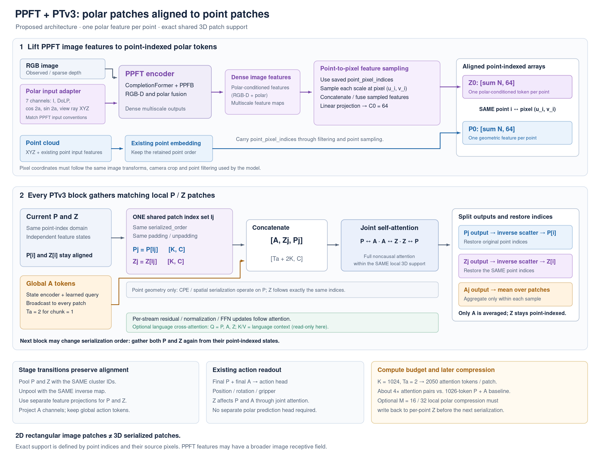
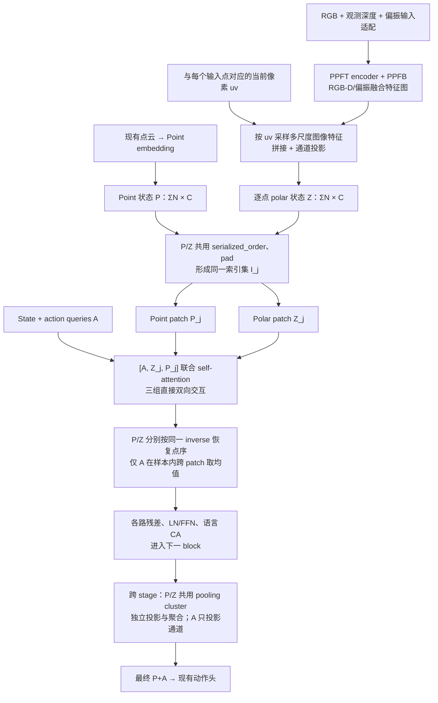

# PTV3：与 Point Patch 对齐的 Polar Patch + PPFT Encoder

状态：设计更新，尚未修改模型、下载权重或训练。这里 PPFT 指 CVPR 2024 的 *Robust Depth Enhancement via Polarization Prompt Fusion Tuning*；已检查本地 `Polarization-Prompt-Fusion-Tuning` 官方代码（HEAD `9b1145d87e50895fd17068fad9cec1199092f67a`）。

推荐把偏振特征先映射到每个点，再和 point 特征共用 PTV3 的 patch 分组。PPFT 可以作为上游图像特征提取器；经过映射后，polar 继续拥有独立、可逐层更新的状态。

## 1. 相比上一版的关键变化

| 项目 | 上一版全局 polar tokens | 本版对齐 polar patches |
|---|---|---|
| Polar 持久状态 | 每个样本固定 M 个 token | 每个 point row 对应一个 polar row |
| Patch 内容 | 所有 point patches 读取同一组 Z | 每个 point patch 读取同一组点对应的 Z |
| 跨 patch 汇总 | Action、polar 分别取均值 | 只有 action 取均值；polar 保留局部对应 |
| Stage 下采样 | Z 只变通道，数量不变 | Z 使用 point 的相同 cluster 下采样 |
| 空间关系 | 由模型学习全局关联 | 通过像素映射、点索引和共同分组建立 |

这里的“对齐”指两路 token 的锚点和分组成员对应。PPFT 特征有较大、甚至全局的图像感受野，不能声称其信息来源被严格限制在该 point patch 的投影区域。

## 2. 总体结构



[SVG 版本](figures/ptv3_aligned_polar_ppft.svg)



PPFT 自身的规则 2D image patches 与 PTV3 的三维序列化 patches 不天然对应。我们在 PPFT 编码完成后，通过像素采样和共享点索引重新组成 polar patches。

## 3. 如何保证 patch 对齐

### 从图像特征到逐点偏振状态

保存每个输入点 \(x_i\) 的当前投影像素 \((u_i,v_i)\)，从 PPFT 的多尺度特征图 \(F^{(l)}\) 中采样：

\[
z_i^0=W\operatorname{Concat}_l
\left[\operatorname{Sample}(F^{(l)},T_l(u_i,v_i))\right]+e_{polar}.
\]

\(T_l\) 包含实际的图像 resize、crop、padding 和特征图采样坐标变换。首版可只取部分高分辨率/中层特征；无需把 PPFT 的六个输出与 PTV3 的五个 stage 强行一一配对。

`P0` 和 `Z0` 都是 `[sum(N), C0]`，第 i 行指向同一个观测点。初始 Z 可以另外加入该点的中心化 XYZ 位置编码，但不改变共同索引。

### 每个 block 动态共用分组

设当前 block 的一个序列化 patch 的原始点索引为 \(I_j\)：

\[
P_j=P[I_j],\qquad Z_j=Z[I_j],\qquad
[A'_j,Z'_j,P'_j]=\operatorname{SelfAttn}([A,Z_j,P_j]).
\]

恢复输出时 P/Z 都应用相同 inverse 和 unpadding；A 仍按原实现，在同一个样本的 patches 之间取均值。**Z 不跨所有 patches 平均。**

PTV3 会切换 Z-order/Hilbert 等顺序并重新分组。因此“第 j 个 patch”不能当作跨层永久身份。永久状态应存回点索引，下一 block 再按它自己的 `serialized_order` 同步分组。

### 下采样与重建

Grid pooling 时，以 P 已经生成的 `cluster / indices / idx_ptr` 分别聚合 P 和 Z，Z 使用自己的通道投影，可采用带有效性权重的均值。不能另为 Z 计算一套独立分组，也不能仅把旧 Z 原样透传，因为此时点数已经改变。

Action 数量不变，只做通道投影。若保留训练用重建 decoder，Z 使用相同 `pooling_inverse` 上采样，并与对应 polar skip 融合；继续复制 encoder 的可变容器，保持动作路径不受重建覆盖。

这些机制是拟议改动。当前代码里的 `polar_feat` 尚不存在，旧 `PointSequential`、pooling 和 attention 都需要显式扩展。

## 4. PPFT 能复用哪些部分

官方 PPFT 使用 CompletionFormer 的 RGB-D backbone，并用 PPFB 逐层融合偏振 prompt。这里建议抽取 **RGB/depth/polar stems + PPFTPVT/PPFB**，在进入深度 decoder 之前返回特征图，不执行深度预测和 NLSPN 传播。[论文 §3.3](https://arxiv.org/html/2404.04318v1)、[官方 backbone](https://github.com/lastbasket/Polarization-Prompt-Fusion-Tuning/blob/master/model/ppft/ppft_backbone.py)

本地可用入口：工作区兄弟仓库的 `Polarization-Prompt-Fusion-Tuning/model/ppft/ppft_backbone.py:149`。当前 `self.former(fe1,prompt)` 的输出 `fe2…fe7` 通道数为 `[64,128,64,128,320,512]`，名义分辨率为 `[1,1/2,1/4,1/8,1/16,1/32]`。需要新增 encoder-only wrapper 暴露这些输出。

这些是 **RGB-D/偏振融合特征**。若希望研究偏振 prompt 的表征，可额外返回 PPFB 更新后的 `prev_prompt`；它也读取 RGB-D 特征。只截取 `conv1_pol_for_rgb` 虽然能只读 polar，但官方 7 通道分支中它仅是一层卷积，不能等同于完整 PPFT encoder。[官方 encoder](https://github.com/lastbasket/Polarization-Prompt-Fusion-Tuning/blob/master/model/ppft/ppft_pvt.py)、[PPFB 实现](https://github.com/lastbasket/Polarization-Prompt-Fusion-Tuning/blob/master/model/ppft/modality_promper.py)

### 输入适配

官方 train/test 选择的 `leichenyang-7` 是：

\[
[I,\rho,\cos(2\phi),\sin(2\phi),V_x,V_y,V_z].
\]

你已有的三个偏振数值通道可以对应其中三项，还需要强度 I、视线方向 V，以及完整 encoder 的 RGB 和观测深度。[官方数据编码](https://github.com/lastbasket/Polarization-Prompt-Fusion-Tuning/blob/master/datasets/hammer.py)

- `I`：官方预处理由四幅 analyzer 图计算强度；现有 dense sidecar 没有保存它。优先从相同帧、相同渲染来源取得一致的强度/S0 并核对标度；RGB 灰度只能作为明确标注的近似。
- `V`：根据 RLBench 自身的相机标定构造，检查轴向、符号、归一化和像素约定，不能复用 HAMMER 的固定 `vd.npy`。
- `depth`：使用实际观测深度，或由实验输入点云在相机坐标下 z-buffer 得到的 sparse depth，明确米制单位及缺失值。不要额外把重建 GT/干净深度送入 encoder。
- `RGB`：核对官方 loader 的色彩顺序、归一化和 PointACT 的输入约定；图像空间变换须与 UV 同步。
- 现有四通道 `[DoLP,cos,sin,mask]` 与官方 `grayscale-4` 的四个 analyzer intensity 含义不同。若采用新四通道 stem，应标记为 PPFT 结构改造/部分权重迁移，并显式处理第一层权重尺寸。
- v2 dense archive 同时有 `valid_mask` 和 `AoLP_valid_mask`；当前 `dense_polar_from_npz()` 的 cos/sin 分支取的是前者。新适配器应区分光学有效性与角度有效性，保留仍然有效的 DoLP。

### 接入前需要解决的具体问题

1. 当前本地 `ckpts/ppft_final` 只有 `model.txt`，清单指向的 `model.pt` 和 foundation `NYUv2.pt` 均未发现。官方有下载脚本，尚未执行或验证下载服务。
2. 当前 `PPFTPVT.prompt_modifier4` 是 `3×3/stride2/padding0`，与主路 `2×2/stride2` 不同。按代码静态计算，256×256 输入末层主路是 8×8，prompt 是 7×7；须使两路显式对齐并做实际前向验证。该判断尚未通过运行模型验证。
3. 原顶层模型会构造完整 CompletionFormer，牵涉 NLSPN/custom deformable convolution；encoder imports 也有 timm、mmcv/mmseg 等依赖。应整理 encoder-only imports 和权重加载，不把原训练栈整体移入 PointACT。
4. PPFT 预训练任务是深度增强，机器人动作成功率的收益尚未知。先冻结提取器验证适配与融合，再比较解冻后段/PPFB 的微调；冻结时也固定 BN/Dropout 状态。

## 5. 当前数据如何支持对齐

已检查 `hybridvla_10tasks_train_keysteps_polar_rlbench9_v2`：有 `polar_frontview_dense`、`point_pixel_indices`、`point_source_pixel_indices`、filled9 点云；**没有 `point_pixel_indices_filled`**。现有 `point_pixel_indices` 对应 incomplete 点云，不能按行用于 filled9。

建议为 filled9 补充逐点像素 sidecar。在线 `experiments/10_rlbench/filled9_inference.py:193` 已将原有像素和新增点像素拼接，`:234` 返回完整 `filled_pixels`，可以复用这套来源记录。离线也可在中心化/增强前按每帧标定重新投影 filled9，检查与原 RGB/polar 取样一致。

corruption 后要用**当前投影像素**，不能替换为 `point_source_pixel_indices` 的原始来源像素。当前 pipeline 已按移动后的坐标重新采样观测；这种索引对齐并不保证受损 XYZ 就是真实表面位置。

过滤、采样、shuffle 点行时，UV 和有效性必须同步。现有 `data/robot/data_3d.py:303` 有将像素索引附加到点行共同处理的机制，可从 material conditioning 中解耦；训练 collator、推理 processor 同步接通。

中心化和三维增强后，不应使用原相机直接重投影变换后的 XYZ。优先保留观测时的 UV；若确实要重新计算，则同时变换相机或恢复到原坐标系。

## 6. 计算量与后续压缩版本

一对一版本每个 patch 有 K 个 point token 和 K 个 polar token，attention 长度由 `K+Ta` 变为 `2K+Ta`，当 K≫Ta 时约有 **4 倍 attention pair 数**；这不等于整体运行时间或显存固定变为四倍。PPFT encoder 和新增投影/FFN/语言 CA 另有开销。

先用这个版本验证索引和三路更新最清楚。若缩小 K 来完成验证，对照组也使用同样的 K；不能把 patch 大小变化和 polar 收益混在一起。

正式规模实验可将每个 polar patch 内 K 行局部压缩为 m=16/32 个 token：

```text
持久逐点 Z_j[K,C] ──local resampler──> R_j[m,C]
                                         │
                               [A, R_j, P_j] joint attention
                                         │
Z_j <── residual cross-attention(Q=Z_j, KV=R'_j)
 │
恢复点序 → 下一 block 按新顺序重新分 patch
```

此时 joint attention pair 数是 `(K+m+Ta)²`，另有 `O(Km)` 的压缩和写回。**m 是每个 patch 的 token 数，不是整张点云共享的 token 数。** 必须把更新后的局部 R 写回其源点的 Z；否则换分组后会丢失 polar 链路的持续更新。重复 padding 不能在局部汇聚时被当成额外真实观测，需要显式有效项/权重。

对于无对应 3D 点的偏振像素，本版只能通过 PPFT 的图像上下文间接利用，不能给它们制造精确点对应。以后可以加少量全局 polar tokens 作为补充，并单独消融。

## 7. 推荐实施与验证顺序

1. 补齐 filled9 像素对应、实际观测深度和标定；固定一帧可视化 point patch 投影及 polar patch，核验索引和归一化。
2. 用轻量 dense encoder 跑通一对一 local patch 链路，确认 P/Z 同步排序、padding、pooling 和 decoder skip；这一步隔离对齐实现与 PPFT 接入问题。
3. 接入 PPFT encoder-only 与权重适配，先冻结，检查所有输入尺寸和特征图坐标。图中展示的是这一步完成后的目标架构。
4. 对比基线、轻量 encoder + aligned patches、PPFT + aligned patches；固定数据、K、预算、重建设定及 seeds。冻结/微调、纯 prompt/fused feature、9D/6D point 输入分别消融。
5. profiling 后再引入每 patch m-token 压缩与写回；额外全局 polar tokens 放在独立实验。

验证应覆盖：P/Z 的点索引与 cluster 成员一致；仅当前样本 action 跨 patch 聚合；换 serialization 顺序后仍保持对应；短 patch/混合点数；图像 resize/crop；无效 AoLP、越界 UV；关闭分支恢复基线；action loss 对 polar 链路的梯度；save/load；在线与离线输入一致。三路 perturbation 检查固定 PPFT 前端输出后分别扰动 P/Z/A，避免 RGB-D 共用输入造成因果混淆。

这份计划提出的是 **PPFT 图像特征 + 点对齐三路 PTV3** 的新接法，尚未证明比当前模型更好。
