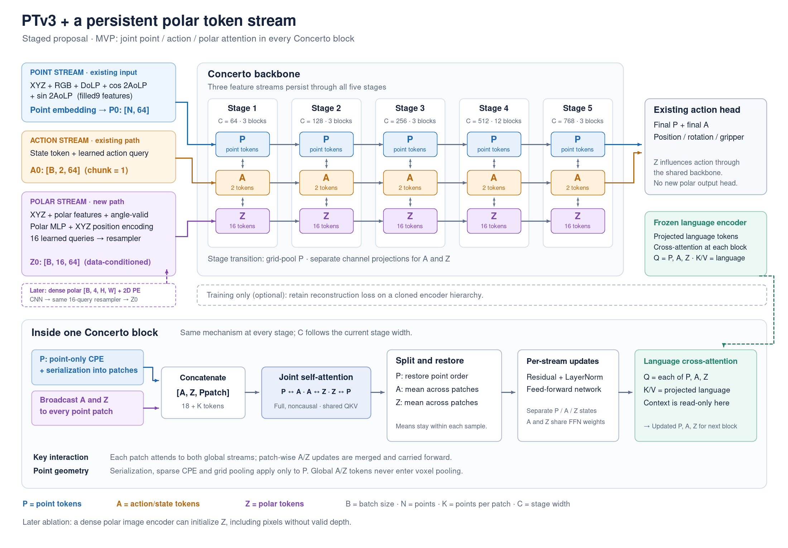
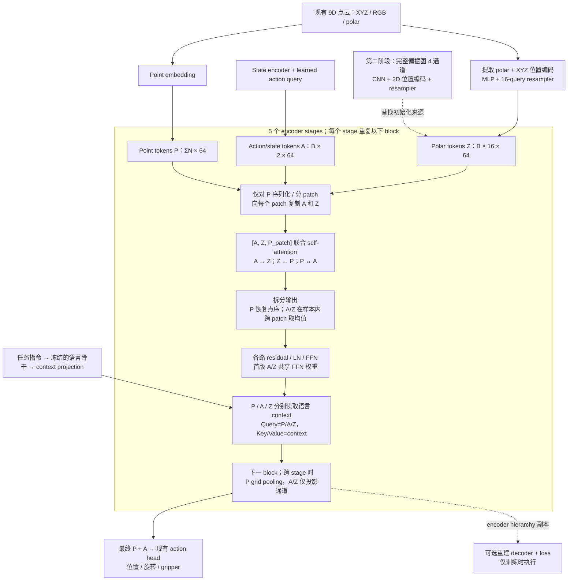

# PTV3 三路交互方案：Point / Action / Polar Tokens

状态：设计计划，尚未实现或训练。依据 2026-09-27 本地 `robot-PointAct` 代码；首版面向当前使用的 Concerto + action classification。

后续方案：用户进一步要求 polar patch 与 point patch 对齐，并考虑 PPFT encoder。当前推荐见 [点对齐 polar patches + PPFT 方案](plan_ptv3_aligned_polar_ppft.md)。本文保留为全局 polar tokens 的对照设计；新版的 polar 状态按点存储，跨 patch 不再取全局均值。

可以沿现有 action token 链路增加独立的 polar token 状态。在每个序列化 point patch 中拼接 `[action/state tokens, polar tokens, point tokens]`，用一次非因果联合 self-attention 实现三组直接双向交互，然后分别保留三路输出进入下一层。

推荐分两步落地：先用现有 9D 点云中的偏振观测生成 polar tokens，验证链路；再换成完整偏振图作为 token 来源，验证深度点缺失但图像仍可见区域的额外价值。前者不增加观测信息，后者改变输入信息量，实验中分别报告。

## 1. 当前实现与可复用部分

| 环节 | 已核实行为 | 位置 |
|---|---|---|
| Action 初始化 | learned action queries；state token 放在前面 | `pointact/model/vla_pointact/modeling_vla_pointact.py:816` |
| Patch attention | 向每个 point patch 复制 action tokens，共享 QKV 做联合 attention | `pointact/model/ptv3/concerto/model_ca_action.py:81` |
| Patch 汇总 | 同一样本的 action 输出跨 patch 取均值 | 同文件 `:147`、`:189` |
| 语言条件 | point/action 分别以 query 读取 context；context 不被更新 | 同文件 `:286` |
| 下采样 | point 做 grid pooling，action 只改变通道数 | 同文件 `:20` |
| 现有偏振输入 | 9D 点特征直接进入 point embedding | `action_head_3d/ptv3_backbone.py:175` |
| 可选材料条件 | dense RGB+polar 经 CNN、材料匹配，采样到 point embedding 后相加 | `polar_material_conditioner.py:29` |

现有材料条件模块没有逐层维护的 polar tokens，也没有直接 action↔polar attention。新增模块应拥有独立开关，不依赖材料候选库。

PTv3 原论文采用点云序列化来组织局部 attention；本方案中的三路交互是基于本仓库 action-token 扩展提出的设计，并非原论文已有模块。[PTv3，CVPR 2024](https://openaccess.thecvf.com/content/CVPR2024/html/Wu_Point_Transformer_V3_Simpler_Faster_Stronger_CVPR_2024_paper.html)

## 2. 结构图



[可缩放 SVG](figures/ptv3_polar_token_architecture.svg)



图中 `A=2` 对应 action chunk 为 1 且启用 state token；一般情况为 `A=action_chunk_size + state_token_count`。循环由 block/stage 编排完成，图中省略反馈线。

## 3. Polar token 的来源

### 第一阶段：复用点对齐偏振输入

保留原有 point 分支的 9D 输入，用同一批采样、中心化后的点产生偏振来源特征：

\[
h_i=\operatorname{MLP}_{pol}([\rho_i,c_i,s_i,v_i])
    +\operatorname{MLP}_{xyz}(\bar x_i),
\quad c_i=\cos(2\phi_i),\;s_i=\sin(2\phi_i).
\]

新建一个小型 learned-query resampler：以 16 个可学习 query 读取每个样本自己的 \(h_i\)，经过残差和 FFN，得到 \(Z_0\in\mathbb R^{B\times16\times64}\)。使用 polar modality embedding 区分 token 类型，query 槽位提供不同的聚合身份。16 是首个实验超参数，不代表 16 种材料或预定义物体。

Polar tokens 必须读取真实偏振观测。仅添加 16 个不读取观测的可学习向量，得到的是额外 latent tokens；可用作容量对照，不能作为偏振分支本身。

输入处理注意：

- 当前 v2-filled 配置采用 `polar_feature_normalization: rgb`，送入网络的是 `[2ρ−1, cos(2φ), sin(2φ)]`。若新 encoder 使用物理范围，应按配置恢复 `ρ=(p6+1)/2`；raw 模式不做这一步。
- 9D 点没有独立 angle-valid 通道。在确认无效角度以 `(0,0)` 表示的 archive 中，可用 `cos²+sin² > ε` 恢复角度有效性；它只是 angle-valid，不能代替深度或全部光学信号的有效性。优先使用可获得的显式 mask。
- 无效 AoLP 不代表 DoLP 也无效，不要把这些点整体从 polar encoder 中删除。消除 NaN/Inf，并区分真实缺失数据和零值观测。
- resampler 按 `npoints_in_batch` 隔离样本，忽略 padding。全缺失来源应使用明确的 fallback，避免全 masked softmax；零点云沿用主干输入约束并显式报错。

这一阶段验证 token 交互结构。它无法补充被点云采样或深度缺失删除的偏振像素。

### 第二阶段：完整偏振图

输入已有的 `polar_dense [B,4,H,W]`，四通道为 `[DoLP, cos(2AoLP), sin(2AoLP), angle_valid]`。用轻量 CNN 降采样、加入 2D 位置编码，再用同样的 16-query resampler 得到 `Z0`；后面的 PTV3 完全复用第一阶段。

已有 dense loader 可以复用，但目前加载、collation、推理路径与 material conditioning / VLM polar 模式耦合，需独立接通 `polar_dense`。尤其 `_material_point_condition()` 不能再把 token 分支的 dense 输入视为“关闭材料条件却传了材料数据”。

该版本能利用相机可见但没有对应深度点的偏振区域；不能声称获得被遮挡表面的观测。当前模型 batch 没有相机内外参，首版使用 2D 位置编码。若后续需要 ray/3D bias，再增加标定字段和几何对应，不能直接给全局 polar latent 赋予虚构 XYZ。

## 4. 每个 block 内的三路交互

设 stage \(s\) 中：

\[
P_s\in\mathbb R^{\sum_b N_{s,b}\times C_s},\quad
A_s\in\mathbb R^{B\times T_a\times C_s},\quad
Z_s\in\mathbb R^{B\times M\times C_s}.
\]

对样本 \(b\) 的每个 point patch \(j\)，以下表示 attention 子层输出，残差与归一化略去：

\[
[\widehat A_{b,j},\widehat Z_{b,j},\widehat P_{b,j}]
=\operatorname{SelfAttn}([A_b,Z_b,P_{b,j}]).
\]

\[
\widehat A_b=\operatorname{Mean}_j\widehat A_{b,j},\qquad
\widehat Z_b=\operatorname{Mean}_j\widehat Z_{b,j}.
\]

这一次 attention 内就有 `P↔A`、`P↔Z`、`A↔Z`，并含各路内部交互。不同 patch 的点不会在同一层直接全局互看；跨 patch 信息通过汇总后的 A/Z 在后续 block 中传播。

随后分别更新三路的残差、LayerNorm 和 FFN。第一版共享联合 attention 的 QKV/output projection，并让 polar 复用 action 的 token-wise FFN 权重，保留独立 polar LN 与状态。这控制新增参数量；完全独立 polar FFN 放在后续容量匹配实验中。

在随后的 CA block 中，三路分别作为 query 读取同一语言 context 的 key/value。建议 `apply_polar_ca=True`，现有 point/action CA 设定保持基线一致。语言 context 不反向更新；三路之间的双向交互由前面的 self-attention 完成。

跨 stage 时：

- `P` 继续做原有 grid pooling、序列化和 point CPE。
- `A` 按原方式投影通道，token 数不变。
- `Z` 通过独立 Linear/LN/activation 投影通道，保持 `M=16`，不参加 voxel pooling。
- 按当前大模型配置使用通道 `[64,128,256,512,768]`、depths `[3,3,3,12,3]`；这些来自选定配置，不能硬编码成所有 PTV3 模型的默认结构。

最终 action head 继续消费 P 和 A；无需新增 polar 输出头。偏振信息已经通过 attention 注入动作和几何表示。

## 5. 实施顺序与文件范围

| 步骤 | 计划改动 | 完成标准 |
|---|---|---|
| 1. Token 初始化 | 新增 `polar_token_encoder.py`；在 `configuration_pointact.py` 定义配置，在 `modeling_vla_pointact.py` 的 classification 路径创建并调用 encoder | 现有 9D 输入得到 `[B,16,C0]`，数值范围、mask、批隔离正确 |
| 2. Backbone 接口 | `action_head_3d/ptv3_backbone.py` 接收 `polar_feat` 并写入 `Point`；原有返回接口保持兼容，调试时可读 polar 输出 | 功能关闭走原路径；新增参数 shape 检查清楚 |
| 3. 三路传播 | 扩展 `concerto/model_ca_action.py` 的 attention、Block、CABlock、pooling/unpooling；处理 `concerto/model.py` 的字段传递 | 所有 encoder stage 保留 polar tokens，三组交互与梯度均接通 |
| 4. 重建与权重 | 若使用重建，decoder 同步传递、投影 polar 和 encoder skip；继续使用 `copy_point_tree()`；核对旧 checkpoint 加载 | reconstruction 开/关均可；只允许预期新增 polar keys 缺失 |
| 5. Dense 输入 | 解耦 `data/robot/data_3d.py`、`data/collators.py`、`processing_vla_pointact.py` 和 model kwargs；替换 encoder 输入前端 | train/eval 使用同一 dense 归一化，token-only 模式不要求材料文件 |
| 6. 实验与诊断 | 新配置与下述对照；记录训练参数量、显存、延迟及逐任务成功率 | 区分结构、额外输入信息、额外模型容量的贡献 |

首版明确支持 Concerto + classification；其他 backend / action head 在配置验证中明确限制，后续再适配。

建议新增配置（命名为计划，尚不存在）：

```yaml
use_polar_tokens: true           # 默认 false，兼容旧模型
polar_token_source: point        # 第二阶段 dense
num_polar_tokens: 16
polar_point_normalization: rgb   # 与实际 point 数据配置一致
polar_token_apply_ca: true
polar_token_share_action_ffn: true
```

训练目标先保持 `L_action + λ_rec L_reconstruction`，重建是否开启及权重与对照组一致；无重建基线只用 action loss。不需要新增材料标签或 polar 重建 loss。先验证动作梯度能训练偏振分支，再决定是否增加辅助目标。

## 6. 不能遗漏的工程细节

1. **Pooling 字段传递。** 基类 `GridPooling` 新建 `Point` 时只显式透传若干字段，目前包含 `action_feat`，不包含 `polar_feat`。必须增加透传或在 wrapper 中保存再恢复，否则第一层下采样就会丢失 polar。
2. **FlashAttention 长度。** 每个 patch 的 packed 长度要加 `Ta+M`；同步修改 `cu_seqlens`、`max_seqlen` 和三段输出切片。支持短 patch 和不同样本的不同点数，不能假设所有 patch 都是 K 个点。
3. **点的索引只服务于点。** polar/action 不加入 point `offset`、`batch`、`coord`、sparse convolution 或 inverse permutation；只把 point 子序列恢复到原点序。
4. **两套 attention 路径。** Flash 与非 Flash 都修改。二者在混合短样本时可能采用不同 patch size，数值对照必须固定相同 patch 划分。维持现配置的 `enable_rpe=False`；若启用 RPE，仅将点相对位置项加到 point×point 子块。
5. **独立残差。** `PointSequential` 对普通模块默认只处理 `.feat`，polar 的 LN/FFN/残差需显式更新；不要顺便改变旧 action 分支行为。
6. **真正关闭分支。** 关闭开关时跳过 token 拼接和所有新算子。把 Z 置零仍改变 attention 的 softmax 分母，不能作为旧模型一致性条件。
7. **Checkpoint。** 保留原有 point/action 参数名与形状；共享 FFN 直接调用现有模块，避免重复注册。加载时检查 missing/unexpected keys，不能用宽泛 `strict=False` 掩盖异常。6D 与 9D stem 的转换作为独立实验明确处理。
8. **重建副本。** 重建继续使用 encoder hierarchy 的容器副本；unpooling 里同步更新 polar 通道与 skip，避免在重建后覆盖动作路径状态。重建仅训练执行，polar token 主链路在推理时保留。

增加 M 个 token 后，单个 patch 的 attention pair 数从 `(K+Ta)²` 变成 `(K+Ta+M)²`。当 K=1024、Ta=2、M=16 时这一项约增加 3.1%；当实际 K=64 时约增加 54.4%。这不是端到端速度或显存估计：还包括 resampler、投影、FFN、语言 CA，且深层短 patch 的相对开销更高，应实际 profiling。

## 7. 验证与消融

实现后的正确性验证：

- 关闭开关、加载相同旧权重、固定 serialization/dropout 等随机因素后，恢复基线输出。
- 固定 P/A/context，仅改变送入 polar encoder 的有效偏振值，检查 A 和 P 输出的响应；固定其他输入，检查 P/A 对 Z 的影响。第一阶段扰动实验需在分叉后的 polar 副本上操作，避免同时改变 9D point 输入。
- action loss 能反传到 polar encoder/resampler；仅修改样本 b 的 polar 时，eval 模式下其他样本输出不变。
- 覆盖 `N<K`、`N=K`、`N>K` 且非 K 整数倍、多样本不同 N、无效角度和整路缺失输入。
- 短训练确认 loss/梯度稳定；验证 save/load、推理处理、重建开关和 decoder skip。

推荐对照：

| 实验 | Point 输入 | 新 tokens 的来源 | 用途 |
|---|---|---|---|
| B0 | 原 9D | 无 | 当前基线 |
| B1 | 原 9D | 16 个不读 polar 的 learned latent，保留相同主干交互 | 控制新增全局 token 的作用；并非精确参数匹配 |
| B2 | 原 9D | 点对齐 polar，M=16 | 首个实现，比较 B0/B1 验证观测相关 token |
| B3 | 原 9D | Dense polar，M=16 | 检查缺深度可见像素的额外价值 |
| B4 | 同源 6D XYZRGB | Dense polar，M=16 | 检查独立分支能否承担全部偏振输入；单独处理 stem 初始化 |

固定训练/评估划分、初始化来源、训练预算、重建设定、corruption 和 rollout seeds，报告总体与逐任务成功率及多个 seed 的不确定性。B2/B3 之后再扫 `M=8/16/32`、仅后几层注入、polar 语言 CA、共享/独立 FFN；不要一次叠加所有改动。

对于实际偏振依赖，B3/B4 可再做观测 polar 打乱或移除的诊断，且保持 point/context 输入不变；attention 可视化作为辅助，不能单独证明偏振提升动作成功率。
